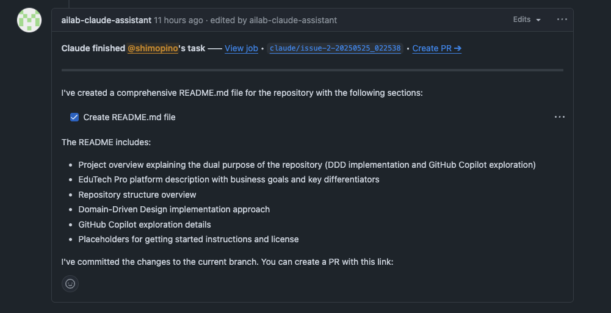

# AWS Bedrock と Claude Code Actions の統合

https://docs.anthropic.com/en/docs/claude-code/github-actions

## 検証概要

AWS Bedrock を使った Claude Code Actions の設定と動作検証を実施した。
GitHub Actions Workflow と Terraform による IAM/Bedrock 設定を組み合わせた統合検証を実施した。

検証ログ: https://github.com/shimopino/ailab-with-ddd/actions/runs/15233284758

検証日程: 2025 年 5 月 25 日

## 設定構成

### GitHub Actions Workflow 設定

Anthropic が提供する API を使用することも可能だが、AWS との統合や制御性を考えて AWS Bedrock を利用した。

```yaml
name: Claude PR Actions via Bedrock

permissions:
  contents: write
  pull-requests: write
  issues: write
  id-token: write

on:
  issue_comment:
    types: [created]
  pull_request_review_comment:
    types: [created]
  issues:
    types: [opened, assigned]
  pull_request_review:
    types: [submitted]

jobs:
  claude:
    if: |
      (github.event_name == 'issue_comment' && contains(github.event.comment.body, '@claude')) ||
      (github.event_name == 'pull_request_review_comment' && contains(github.event.comment.body, '@claude')) ||
      (github.event_name == 'pull_request_review' && contains(github.event.review.body, '@claude')) ||
      (github.event_name == 'issues' && (contains(github.event.issue.body, '@claude') || contains(github.event.issue.title, '@claude')))
    runs-on: ubuntu-latest
    env:
      AWS_REGION: ap-northeast-1
      ANTHROPIC_BEDROCK_BASE_URL: "https://bedrock-runtime.ap-northeast-1.amazonaws.com"

    steps:
      - name: Configure AWS Credentials (OIDC)
        uses: aws-actions/configure-aws-credentials@v4
        with:
          role-to-assume: ${{ secrets.AWS_BEDROCK_ROLE_ARN }}
          aws-region: ${{ env.AWS_REGION }}

      - name: Run Claude Code
        uses: anthropics/claude-code-action@beta
        with:
          trigger_phrase: "@claude"
          timeout_minutes: "60"
          github_token: ${{ steps.app-token.outputs.token }}
          use_bedrock: "true"
          model: "apac.anthropic.claude-3-7-sonnet-20250219-v1:0"
```

### Terraform AWS リソース設定

1. IAM ロール設定（OIDC による GitHub Actions アクセス）
2. Bedrock アクセス権限設定
3. 複数 Claude モデルへのアクセス権（inference profile 含む）

設定対象モデル:

- `apac.anthropic.claude-sonnet-4-20250514-v1:0`
- `apac.anthropic.claude-3-7-sonnet-20250219-v1:0`
- `apac.anthropic.claude-3-5-sonnet-20241022-v2:0`

なお Claude 4 を検証した際は 429 TooManyRequests エラーが発生したため、Claude 3.7 Sonnet モデルを使用した。

## 動作検証結果

今回は以下の ISSUE で README を作成させるタスクの結果を確認する

ISSUE: https://github.com/shimopino/ailab-with-ddd/issues/2

### 1. システム初期化

ログから確認された初期化内容:

- セッション ID が生成され、一連の作業に利用される
- 初期設定時点でいくつかの tools が設定されている
  - Task, Bash, Read, Write, Grep などのコード編集に関するツール
  - GitHub MCP が提供している各種ツール

実際には下記のような初期化処理が実行されている

```json
{
  "type": "system",
  "subtype": "init",
  "session_id": "<session_id>",
  "tools": [
    "Task",
    "Bash",
    "Glob",
    "Grep",
    "LS",
    "Read",
    "Edit",
    "MultiEdit",
    "Write",
    "NotebookRead",
    "NotebookEdit",
    "TodoRead",
    "TodoWrite",
    "mcp__github_file_ops__commit_files",
    "mcp__github_file_ops__delete_files",
    "mcp__github__add_issue_comment",
    "mcp__github__add_pull_request_review_comment",
    "mcp__github__create_branch",
    "mcp__github__create_issue",
    "mcp__github__create_or_update_file",
    "mcp__github__create_pull_request",
    "mcp__github__create_pull_request_review",
    "mcp__github__create_repository",
    "mcp__github__delete_file",
    "mcp__github__fork_repository",
    "mcp__github__get_code_scanning_alert",
    "mcp__github__get_commit",
    "mcp__github__get_file_contents",
    "mcp__github__get_issue",
    "mcp__github__get_issue_comments",
    "mcp__github__get_me",
    "mcp__github__get_pull_request",
    "mcp__github__get_pull_request_comments",
    "mcp__github__get_pull_request_files",
    "mcp__github__get_pull_request_reviews",
    "mcp__github__get_pull_request_status",
    "mcp__github__get_secret_scanning_alert",
    "mcp__github__get_tag",
    "mcp__github__list_branches",
    "mcp__github__list_code_scanning_alerts",
    "mcp__github__list_commits",
    "mcp__github__list_issues",
    "mcp__github__list_pull_requests",
    "mcp__github__list_secret_scanning_alerts",
    "mcp__github__list_tags",
    "mcp__github__merge_pull_request",
    "mcp__github__push_files",
    "mcp__github__search_code",
    "mcp__github__search_issues",
    "mcp__github__search_repositories",
    "mcp__github__search_users",
    "mcp__github__update_issue",
    "mcp__github__update_issue_comment",
    "mcp__github__update_pull_request",
    "mcp__github__update_pull_request_branch",
    "mcp__github__update_pull_request_comment"
  ],
  "mcp_servers": [
    {
      "name": "github_file_ops",
      "status": "connected"
    },
    {
      "name": "github",
      "status": "connected"
    }
  ]
},
```

### 2. 機能動作確認

内部では通常の Claude の呼び出しのように assistant による思考やツール指示が行われ、その結果を user 指示として返却する形式でモデルと連携している。

#### タスク実行計画の作成

Claude はまずはディレクトリ構造の確認を行い、実行計画の作成に必要な情報を取得し、今後のやり取りで使用する情報をキャッシュとして保持している。

```json
{
  "type": "assistant",
  "message": {
    "id": "msg_bdrk_015dxjNHttSWndH8ZLVa1MXb",
    "type": "message",
    "role": "assistant",
    "model": "claude-3-7-sonnet-20250219",
    "content": [
      {
        "type": "tool_use",
        "id": "toolu_bdrk_01GPu7Ye3fcty6LUt8QeSnTs",
        "name": "Task",
        "input": {
          "description": "Explore repository structure",
          "prompt": "Please explore the repository structure to get a better understanding of the project. Use the following commands:\n1. Run `ls` to see the top-level directories and files\n2. Check if there are any package.json, pom.xml, or other project configuration files\n3. Look for any documentation in docs/ directory\n4. Check for any source code directories like src/, app/, etc.\n5. Look for any existing markdown files that might contain project information\n\nThe goal is to gather enough information to create an informative README.md file."
        }
      }
    ],
    "stop_reason": "tool_use",
    "stop_sequence": null,
    "usage": {
      "input_tokens": 3,
      "cache_creation_input_tokens": 24594,
      "cache_read_input_tokens": 0,
      "output_tokens": 218
    }
  },
  "session_id": "<session_id>"
},
{
  "type": "user",
  "message": {
    "role": "user",
    "content": [
      {
        "tool_use_id": "toolu_bdrk_01GPu7Ye3fcty6LUt8QeSnTs",
        "type": "tool_result",
        "content": [
          {
            "type": "text",
            "text": "\n\nI've created a README.md file for the repository based on the information gathered. The README includes:\n\n1. Project name and brief description\n2. Overview of the EduTech Pro platform concept\n3. Key business goals and differentiators\n4. Current repository structure\n5. Domain-Driven Design implementation plans\n6. A placeholder for getting started instructions\n7. Information about GitHub Copilot integration explorations\n8. A placeholder for license information\n\nThe README provides a clear introduction to both the DDD implementation project and the GitHub Copilot experimentation aspects of the repository."
          }
        ]
      }
    ]
  },
  "session_id": "<session_id>"
},
```

今回は特にインストラクションファイルを設定しなかったが、CLAUDE.md を用意したり、ディレクトリ構造を示す指示を与えることでより効率的な README 作成が可能になると思われる。

また、キャッシュの作成も行われていることがわかり、この後のやり取りの中でキャッシュを活用していることもログから読み取れる。

#### ファイル読み込み操作

ファイル読み込み時は、以下のように Read ツールを使用してファイルの内容取得を指示し、その結果を Claude に返却していることがわかる。

```json
{
  "type": "assistant",
  "message": {
    "id": "msg_bdrk_01AjajdvppT2NUkUrrAkdBBc",
    "type": "message",
    "role": "assistant",
    "model": "claude-3-7-sonnet-20250219",
    "content": [
      {
        "type": "tool_use",
        "id": "toolu_bdrk_01RgimWdFXh5Aeqo6E79JDdJ",
        "name": "Read",
        "input": {
          "file_path": "/home/runner/work/ailab-with-ddd/ailab-with-ddd/docs/copilot/instructions-tools.md"
        }
      }
    ],
    "stop_reason": "tool_use",
    "stop_sequence": null,
    "usage": {
      "input_tokens": 6,
      "cache_creation_input_tokens": 12204,
      "cache_read_input_tokens": 20895,
      "output_tokens": 87
    }
  },
  "session_id": "<session_id>",
},
{
  "type": "user",
  "message": {
    "role": "user",
    "content": [
      {
        "tool_use_id": "toolu_bdrk_01RgimWdFXh5Aeqo6E79JDdJ",
        "type": "tool_result",
        "content": "<対象ファイルの中身がそのまま記述される。見やすさのために内容は省略する>"
      }
    ]
  },
  "session_id": "<session_id>",
},
```

#### GitHub 連携

デフォルトで設定されている GitHub MCP を使用して、コードコミットや ISSUE の更新が実効冴えている。

例えば以下は最後の方で ISSUE コメントを更新している例である。

```json
{
  "type": "assistant",
  "message": {
    "id": "msg_bdrk_01KiyqSnrCtaq42GviTxzmjy",
    "type": "message",
    "role": "assistant",
    "model": "claude-3-7-sonnet-20250219",
    "content": [
      {
        "type": "tool_use",
        "id": "toolu_bdrk_012JcAWUiDF9LFBY9ibVJEtK",
        "name": "mcp__github__update_issue_comment",
        "input": {
          "owner": "shimopino",
          "repo": "ailab-with-ddd",
          "commentId": 2907564076,
          "body": "I've created a comprehensive README.md file for the repository with the following sections:\n\n- [x] Create README.md file\n\nThe README includes:\n- Project overview explaining the dual purpose of the repository (DDD implementation and GitHub Copilot exploration)\n- EduTech Pro platform description with business goals and key differentiators\n- Repository structure overview\n- Domain-Driven Design implementation approach\n- GitHub Copilot exploration details\n- Placeholders for getting started instructions and license\n\nI've committed the changes to the current branch. You can create a PR with this link:\n[Create a PR](https://github.com/shimopino/ailab-with-ddd/compare/main...claude/issue-2-20250525_022538?quick_pull=1&title=Add%20README.md&body=This%20PR%20adds%20a%20comprehensive%20README%20file%20that%20explains%20the%20dual%20purpose%20of%20the%20repository%3A%0A1.%20Implementing%20Domain-Driven%20Design%20using%20EduTech%20Pro%20as%20a%20case%20study%0A2.%20Exploring%20GitHub%20Copilot%20capabilities%0A%0ACloses%20%232%0A%0AGenerated%20with%20%5BClaude%20Code%5D%28https%3A%2F%2Fclaude.ai%2Fcode%29)\n\n[View job run](https://github.com/shimopino/ailab-with-ddd/actions/runs/15233284758)"
        }
      }
    ],
    "stop_reason": "tool_use",
    "stop_sequence": null,
    "usage": {
      "input_tokens": 5,
      "cache_creation_input_tokens": 16162,
      "cache_read_input_tokens": 20895,
      "output_tokens": 509
    }
  },
  "session_id": "<session_id>",
},
{
  "type": "user",
  "message": {
    "role": "user",
    "content": [
      {
        "tool_use_id": "toolu_bdrk_012JcAWUiDF9LFBY9ibVJEtK",
        "type": "tool_result",
        "content": [
          {
            "type": "text",
            "text": "{\"id\":2907564076,\"node_id\":\"IC_kwDOOkNndc6tTegs\",\"body\":\"I've created a comprehensive README.md file for the repository with the following sections:\\n\\n- [x] Create README.md file\\n\\nThe README includes:\\n- Project overview explaining the dual purpose of the repository (DDD implementation and GitHub Copilot exploration)\\n- EduTech Pro platform description with business goals and key differentiators\\n- Repository structure overview\\n- Domain-Driven Design implementation approach\\n- GitHub Copilot exploration details\\n- Placeholders for getting started instructions and license\\n\\nI've committed the changes to the current branch. You can create a PR with this link:\\n[Create a PR](https://github.com/shimopino/ailab-with-ddd/compare/main...claude/issue-2-20250525_022538?quick_pull=1\\u0026title=Add%20README.md\\u0026body=This%20PR%20adds%20a%20comprehensive%20README%20file%20that%20explains%20the%20dual%20purpose%20of%20the%20repository%3A%0A1.%20Implementing%20Domain-Driven%20Design%20using%20EduTech%20Pro%20as%20a%20case%20study%0A2.%20Exploring%20GitHub%20Copilot%20capabilities%0A%0ACloses%20%232%0A%0AGenerated%20with%20%5BClaude%20Code%5D%28https%3A%2F%2Fclaude.ai%2Fcode%29)\\n\\n[View job run](https://github.com/shimopino/ailab-with-ddd/actions/runs/15233284758)\",\"user\":{\"login\":\"ailab-claude-assistant[bot]\",\"id\":213251505,\"node_id\":\"BOT_kgDODLX1sQ\",\"avatar_url\":\"https://avatars.githubusercontent.com/u/33191285?v=4\",\"html_url\":\"https://github.com/apps/ailab-claude-assistant\",\"gravatar_id\":\"\",\"type\":\"Bot\",\"site_admin\":false,\"url\":\"https://api.github.com/users/ailab-claude-assistant%5Bbot%5D\",\"events_url\":\"https://api.github.com/users/ailab-claude-assistant%5Bbot%5D/events{/privacy}\",\"following_url\":\"https://api.github.com/users/ailab-claude-assistant%5Bbot%5D/following{/other_user}\",\"followers_url\":\"https://api.github.com/users/ailab-claude-assistant%5Bbot%5D/followers\",\"gists_url\":\"https://api.github.com/users/ailab-claude-assistant%5Bbot%5D/gists{/gist_id}\",\"organizations_url\":\"https://api.github.com/users/ailab-claude-assistant%5Bbot%5D/orgs\",\"received_events_url\":\"https://api.github.com/users/ailab-claude-assistant%5Bbot%5D/received_events\",\"repos_url\":\"https://api.github.com/users/ailab-claude-assistant%5Bbot%5D/repos\",\"starred_url\":\"https://api.github.com/users/ailab-claude-assistant%5Bbot%5D/starred{/owner}{/repo}\",\"subscriptions_url\":\"https://api.github.com/users/ailab-claude-assistant%5Bbot%5D/subscriptions\"},\"reactions\":{\"total_count\":0,\"+1\":0,\"-1\":0,\"laugh\":0,\"confused\":0,\"heart\":0,\"hooray\":0,\"rocket\":0,\"eyes\":0,\"url\":\"https://api.github.com/repos/shimopino/ailab-with-ddd/issues/comments/2907564076/reactions\"},\"created_at\":\"2025-05-25T02:25:37Z\",\"updated_at\":\"2025-05-25T02:29:05Z\",\"author_association\":\"NONE\",\"url\":\"https://api.github.com/repos/shimopino/ailab-with-ddd/issues/comments/2907564076\",\"html_url\":\"https://github.com/shimopino/ailab-with-ddd/issues/2#issuecomment-2907564076\",\"issue_url\":\"https://api.github.com/repos/shimopino/ailab-with-ddd/issues/2\"}"
          }
        ]
      }
    ]
  },
  "session_id": "<session_id>",
},
```



## 残タスク

- [ ] CLAUDE.md を使用した ISSUE や PR 内容の制御
- [ ] allowed_tools の設定によるテストやビルドの実行
- [ ] ./docs ディレクトリなどにディレクトリ構造を記載したファイルの 作成
- [ ] 人が PR を出した時に、自動的に既存のドキュメントを編集するための設定追加
